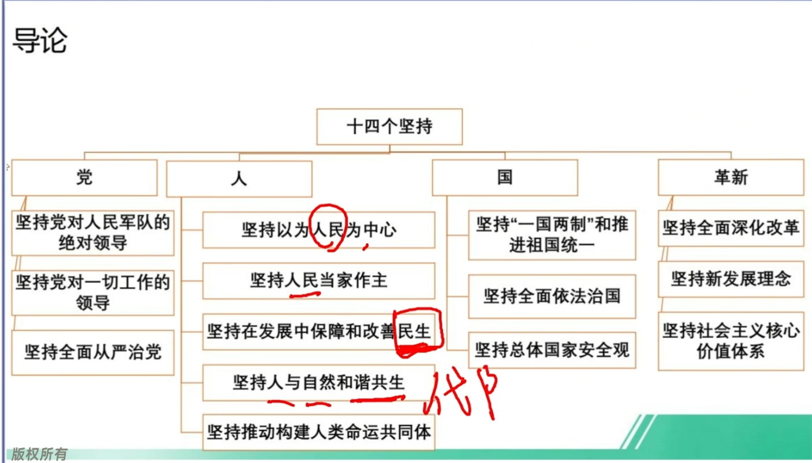

# 习概新思想 

一. 习近平新时代中国特色社会主义思想创立的时代背景
1. 世界`百年未有之大变局`加速演进。
2. 中华民族伟大复兴进入`关键时期`。
3. `中国式现代化`全面推进拓展。
4. 科学社会主义在21世纪的中国焕发新的`蓬勃生机`。
5. 中国共产党`自我革命`开辟新的境界

二. 习近平新时代中国特色社会主义思想是“两个结合”的重大结果
特别要注意理解`马克思主义(魂脉)`与`中华优秀传统文化(根脉)`之间的关系。
(1)坚守好`魂(马克思主义)和根（中华优秀传统文化）`,是理论创新的`基础和前提`。
(2)`中华优秀传统文化`是中华文明的智慧结晶和精华所在，是`中华民族的根和魂`，是我们在世界文化激荡中站稳脚跟的`根基`，是我们党创新理论的`“根”`。

习近平新时代中国特色社会主义思想是马克思主义基本原理同`中国具体实际`相结合，同`中华优秀传统文化`相结合的重大成果，是坚持“两个结合”的光辉典范。“两个结合”是我们党在探索中国特色社会主义道路中得出的`规律性认识`，是我们取得成功的`最大法宝`。

三，习近平新时代中国特色社会主义思想是完整的科学体系
1. 科学回答的重大时代课题：`新时代坚持和发展什么样的中国特色社会主义，怎样坚持和发展中国特色社会主义`，建设什么样的社会主义现代化强国，怎样建设社会主义现代化强国，建设什么样的长期执政的马克思主义政党，怎样建设长期执政的马克思主义政党。

科学体系= 十个明确 十四个坚持 十三个方面成就 + 六个必须坚持 世界观 方法论

1. 十个明确
明确中特色的总任务是实现`社会主义现代化和中华民族伟大复兴`。
明确新时代我国社会主要矛盾是`人民日益增长的美好生活需要和不平衡不充分发展之间的矛盾`
明确中特色的`总体布局`是`五位一体`（政治建设，经济建设，文化建设，社会建设，生态文明建设），`战略布局`是`四个全面`(全面建设社会现代化国家，全面深化改革，全面依法治国，全面从严治党)。
明确全面深化`改革的总目标`是`完善和发展中国特色社会主义制度，推进国家治理体系和治理能力的现代化`。
明确全面推进`依法治国总目标`是建设`中国特色社会主义法治体系，建设社会主义法治国家`。

明确党在新时代的`强军目标`是建设一支`听党指挥，能打胜仗，作风优良的人民军队`。
明确中国特色`大国外交`要服务民族复兴，促进人类进步（主线），推动`构建新型国际关系，推动构建人类命运共同体(总目标)`。
明确中国特色社会主义`最本质的特征`是`中国共产党的领导，全党必须增强四个意识，坚定四个自信，做到两个维护`。
明确必须坚持和完善`社会主义基本经济特征`，使`市场`在资源配置中起决定性作用，更好发挥政府作用，把握新发展阶段，贯彻`创新`，`协调`，`绿色`，`开发`，`共享`的新发展理念，加快构建以国内大循环为主体，国内国际双循环相互促进的新发展格局，推动高质量发展，统筹发展和安全
明确全面从严治党的战略方针，提出新时代党的建设总要求，全面推进党的`政治建设`，`思想建设`，`组织建设`，`作风建设`，`纪律建设`，`把制度建设`贯穿其中，深入推进反腐败斗争，落实管党治党政治责任，以伟大自我革命引领伟大社会革命

十四个坚持
坚持党对一切工作的领导
坚持以为人民为中心
坚持全面深化改革
坚持新发展理念
坚持人民当家作主
坚持全面依法治国
坚持社会主义核心价值观体系
坚持在发展中保障和改善民生
坚持人和自然和谐共生
坚持总体国家安全观
坚持党对人民军队的绝对领导
坚持“一国两制”和推进国家统一
坚持推动构建人类命运共同体
坚持全面从严治党

六个必须坚持
1. 坚持`人民至上`是根本价值立场，体现了历史唯物主义群众史观
2. 坚持`自信自立`是内在精神特质，体现了客观规律性和主观能动性的有机结合。
3. 坚持`守正创新`是内在精神特质，体现了变与不变，继承与发展的内在联系
4. 坚持`问题导向`是重要实践要求，体现了矛盾的普遍性和客观性。
5. 坚持`系统观念`是基本思想和工作方法，体现了辩证唯物主义普遍联系的原理
6. 坚持`胸怀天下`是中国共产党人的境界格局，体现了马克思主义追求人类进步和解放的崇高理想

坚持道路自信，理论自信，制度自信，文化自信
1. 改革开发以来我们`取得一切成绩和进步的根本原因`，归结起来就是：开辟了中国特色社会主义道路，形成了中国特色社会主义理论体系，确立了中国特色社会主义制度，发展了中国特色社会主义文化。其中，`道路是实现途径，理论体系是行动指南，制度是根本保障，文化是精神力量`，四者统一于中国特色社会主义伟大实践。
2. 新时代坚持和发展中国特色社会主义，必须坚定四个自信。
3. 中国特色社会主义四个自信，`来源于实践，来源于人民，来源于真理`。
4. 坚定中国特色社会主义四个自信，`中国共产党和中国人民有着深厚的根基和底气`

中国特色社会主义新时代是我国发展新的历史方位

1. 党的`十九大`作出中国特色社会主义进入新时代这个重大政治论断。`新时代`是我国发展新的历史方位，标志着中国特色社会主义事业进入了`新的发展阶段`。

2. 中国特色社会主义进入了`新时代的内涵`

1. 历史性：承前启后，继往开来，在新的历史条件下继续夺取`中国特色社会主义伟大胜利`的时代。
2. 实践性：决胜`全面建成小康社会`，进而`全面建设社会主义现代化强国`的时代。
3. 人民性：全国各族人民团结奋斗，不断创造美好生活，逐步实现全体人民`共同富裕`的时代。
4. 民族性：全体中华儿女协力同心，奋力`实现中华民族伟大复兴中国梦`的时代。
5. 世界性：这个新时代是我国日益`走进世界`舞台中央，不断为人类作出更大贡献的时代。

3. 中国特色社会主义进入新时代的依据

1. 是我国`社会主要矛盾发生新变化`的反映。是我们党作出中国特色社会主义进入新时代重大判断的基本依据。
2. 是`党的主要任务发生新变化`的反映。
3. 是`中国和世界关系发生新变化`的反映。

社会主要矛盾变化是关系全局的历史性变化

新矛盾：人民日益增长的`美好生活需要和不平衡不充分`的发展之间的矛盾的重大战略判断。

1. 新时代我国社会主要矛盾的变化，反映了社会发展的客观实际，明确了解当代中国发展主要问题的根本着力点。
2. 新时代我国社会主要矛盾的变化，是关系全局的历史性变化，对党和国家工作提出了许多新要求。
3. 我国仍处于并将`长期处于社会主义初级阶段的基本国情没有变`，我国是世界最大的发展中国家的`国际地位没有变`。

新时代伟大变革及其里程碑意义

1. 走过百年奋斗历程的中国共产党在革命性锻造中更加`坚强有力`，在坚持和发展中国特色社会主义的历史进程中始终成为坚强`领导核心`.
2. 中国人民的前进动力更加强大，必胜信念更加坚定，焕发出更为强烈的历史自觉和主动精神。
3. 改革开放和社会主义现代化建设深入推进，书写了经济快速发展和社会长期稳定两大奇迹新篇章，我国发展具备了`更为完善的制度保证`，实现中华民族伟大复兴进入了`不可逆转`的历史进程。
4. 科学社会主义在21世纪的中国焕发出新的`蓬勃生机`，中国式现代化为人类实现现代化提供了`新的选择`。

全面贯彻党的基本理论，基本路线，基本方略
党的基本理论，基本路线，基本方略，事关党的前途命运，事关中国特色社会主义事业兴衰成败。
1. 党的基本理论是坚持和发展中国特色社会主义的行动指南。
2. 党的基本路线是国家的生命线，人民的幸福线。
3. 基本方略-十四个坚持，反映了我们党对建设中国特色社会主义的规律性认识。

统筹推进 五位一体 总体布局和协调推进 四个全面 战略布局
1. 五位一体 `总体布局`是指经济建设，政治建设，文化建设，社会建设，生态文明建设
2. 四个全面 `战略布局`是指全面建设社会主义现代化国家，全面深化改革，全面依法治国，全面从严治国。

(了解)
推动中国特色社会主义不断开拓前进
社会主义是前无古人的伟大事业，没有现成的方案可以遵循，必须随着时代，实践和科学的发展不断探索前进。
1.社会主义是一个`不断发展和完善`的实践过程，需要一代又一代人的接续奋斗
2.社会主义发展道路从来都不是笔直的，始终`充满着险阻曲折`，需要依靠顽强斗争打开事业发展新天地。
3.在人类社会的漫漫历史长河中，社会主义发展的历史不算长，然而，社会主义的理论和实践，却深刻`改变了亿万人民的命运`，影响了人类历史发展的方向。

`实现中华民族的伟大复兴，就是中华民族近代以来最伟大的梦想。`
中国梦=中华民族伟大复兴=现代化强国=第二个百年奋斗目标

中国梦的本质 (主观题)
`国家富强` (基础 保障 前提)
`民族振兴` ()
`人民幸福` (出发点，落脚点，根本目的，归宿)

2020-2035
我国发展的总体目标
1. 人均国内生成总值迈上新的打台阶，达到`中等发达`国家水平。
2. 实现高水平科技自立自强，`进入创新型国家前列`；
3. 建成现代化经济体系，形成新发展格局。
4. 生态环境根本好转，美丽中国目标`基本实现`。
5. 人的全面发展，`全体人民共同富裕取得更为明显的实质性进展`

2035-2050
1. 把我国建设成为富强民族文明和谐美丽的`社会主义现代化强国`
2. `全体人民共同富裕基本实现 `

1. 坚持`党的全面领导/改革开发`是坚持和发展中国特色社会主义的必由之路。
2. `中国特色社会主义`是实现中华民族伟大复兴的必由之路。
3. `团结奋斗`是中国人民创造历史伟业的必由之路。
4. 贯彻`新发展理念`是新时代我国发展壮大的必由之路。
5. `全面从严治党`是党永葆生机活力，走好新的赶考之路的必由之路。

`自主创新` 是我们攀登世界科技高峰的必由之路
`开放` 是国家繁荣的必由之路
`依法治港治澳`，是全面准确贯彻 “一国两制” 方针的必由之路

新民主主义革命时期：我们党团结带领人民进行革命斗争，取得新民主主义革命的胜利，为实现现代化创造了`根本社会条件`。
社会主义革命和建设时期：我们党带领人民完成了社会主义革命，推动了社会主义建设，为现代化建设奠定了`根本政治前提和制度基础`，提供了`宝贵经验，理论准备，物质基础`。
改革开发和社会主义现代化建设新时期：我们党作出把党和国家工作中心转移到经济建设上来，实行改革开放的历史性决策，开启了中国现代化的新长征，为中国式现代化提供了`充满新的活力体制保证和快速发展的物质条件`。
进入新时代：我们党围侥解决现代化建设中存在的突出矛盾和问题，不断实现理论和实践上的创新突破，成功推进和拓展了中国式现代化。创立了习近平新时代中国特色社会主义思想，实现了马克思主义中国化时代化新的飞跃，为中国式现代化提供了根本遵循；实现`一系列突破性进展，取得一系列标志性成果`，推动党和国家事业取得历史性成就，发生历史性变革，为中国式现代化`提供了更为完善的制度保证，更为坚实的物质基础，更为主动的精神力量。`

中国现代化的本质要求(主)
1. 本质要求(9条)：坚持中国共产党领导，坚持`中国特色社会主义`，实现`高质量发展`，发展`全过程人民民主`，丰富人民`精神`世界，实现`全体人民共同富裕`,促进`人与自然和谐共生`，推动构建`人类命运共同体`，创造`人类文明新形态`
这一本质要求符合人类现代化的一般规律，阐明了中国式现代化的内在规定性，明确了中国式现代化的领导力量，发展道路和根本方向，总体布局和战略要求，以及对人类文明和世界发展的重大意义，是推进中国式现代化的重要遵循。

中国式现代化的中国特色（主观题）
1. 中国式现代化是`人口规模`巨大的现代化 -- 显著特征
2. 中国式现代化是`全体人民共同富裕`的现代化 -- 本质特征/中国现代化区别于西方现代化的`显著标志`
3. 中国式现代化是`物质文明和精神文明`相协调的现代化 -- 崇高追求  物质富足，精神富有是社会主义现代化的`根本要求`
4. 中国式现代化是`人与自然和谐共生`的现代化 -- 鲜明特点
5. 中国式现代化是`走和平发展道路`的现代化 -- 突出特征

为什么要强调党在中国式现代化建设中的领导地位？(主)
中国式现代化是`中国共产党领导`的社会主义现代化，这是中国式现代化的`定性，是管总体，管根本的`。党的领导直接关系中国式现代化的`根本方向`，`前途命运`，`最终成败`。
1. 党的领导决定中国式现代化的根本性质 (是社会主义现代化)。
2. 党的领导确保中国现代化锚定奋斗目标行稳致远 (一代一代地接力推进)。
3. 党的领导激发建设中国式现代化的强劲动力(改革开放)。
4. 党的领导凝聚建设中国式现代化的磅礴力量(汇集全体人民的智慧和力量)。

中国式现代化创造了`人类文明新形态`/中国式现代化的意义(主)
中国式现代化，深深值根于中华优秀传统文化，体现科学社会主义的先进本质，借鉴吸收一切人类优秀文明成果，代表人类文明进步的发展方向，是一种全新的人类文明形态
1. 中国式现代化提供了一种`全新的现代化模式`。打破了 “现代化=西方化” 的迷思
2. 中国式现代化是对西方现代化理论和实践的`重大超越`。是对世界现代化理论和实践的重大创新
3. 中国式现代化为广大发展中国家提供了`全新选择`。

推进中国式现代化需要牢牢把握的重大原则(主)
1. 坚持和加强`党`的全面领导。 (领导力量)
2. 坚持中国`特色社会主义`道路。(旗帜方向)
3. 坚持以`人民`为中心的发展思想。(价值立场)
4. 坚持深化`改革开放`。(根本动力)
5. 坚持发扬`斗争精神`。(精神状态)

推进中国式现代化需要正确处理的重大关系(了解)
1. 正确处理顶层设计与实践探索的关系。
2. 正确处理战略与策略的关系。
3. 正确处理守正与创新的关系。
4. 正确处理效率与公平的关系。
5. 正确处理活力与秩序的关系
6. 正确处理自立自强与对外开放的关系。
    `独立自主`是`中华民族精神之魂`，是我们立党立国对重要原则。
    `对外开放`是中国的`基本国策`，任何时候都不能动摇。

推进中国式现代化必须坚持团结奋斗
1. `团结就是力量，奋斗开创未来`。
2. 中国民族是有着`伟大团结奋斗精神`的民族。
3. 中国式现代化是一个伟大而艰巨的事业，前进道路必然风雨兼程，需要全党全国各族人民`团结奋斗`的步调更加一致，意志更加顽强。
4. `团结奋斗`是中国共产党和中国人民`最显著的精神标识`，是中国人民创造历史伟业的`必由之路`。

一. 中国最大的国情就是`中国共产党的领导` (主观题)
1. 中国共产党是中国特色社会主义事业的`坚强领导核心`。
2. 中国共产党是`最高政治领导力量`。
3. 中国共产党是`人民当家作主`的可靠保障。
4. 中国共产党领导关系`中国特色社会主义的性质，方向和命运`。中国特色社会主义之所以是社会主义，究其`根本`就在于坚持科学社会主义基本原则，在于坚持中国共产党的领导。
5. 党的领导是党和国家的根本所在，命脉所在，是全国各族人民的利益所系，命运所系
6. 是`实现中华民族伟大复兴`的`根本保证`。

二. `中国共产党领导`是中国特色社会主义制度的最大优势.(最显著优势) (主观题)
1. 中国共产党以马克思主义作为行动指南，在实践中不断推进马克思主义中国化时代化，为坚持和完善中国特色社会主义制度提供`强大理论优势`。
2. 中国共产党的自身优势是中国特色社会主义制度优势的`主要来源`。
3. 中国共产党能够集中全党全国力量，凝聚全民族共同意志，在各项事业中发挥总揽全局，协调各方的作用，确保中国特色社会主义制度的`显著优势充分彰显`。

三. 加强党的全面领导为新时代党和国家事业发展提供了坚强保证 (主)
1. 使党的``领导核心``作用充分彰显
2. 使党的政治领导力，思想引领力，群众组织力，社会号召力`显著增强`。
3. 为推进新时代中国特色社会主义事业提供了`政治保证`，使党成为风雨来袭时中国人民`最可靠的主心骨`。

一。中国共产党是最高政治领导力量
1. 中国共产党得到了最广大人民群众的支持和拥护，得到了各民主党派，各团体，各民族，各阶级，各界人士的支持和拥护。中国共产党作为最高政治领导力不是自封的，而是在`历史发展中`形成的。
2. 中国共产党作为最高政治领导力量是由`我国国家性质和政治制度体系`决定的。中国共产党是我国`最高政治领导力量`，`党的领导制度`在我国国家政治制度体系中居于`统治地位`。
3. 中国共产党作为最高政治统治力量是由`中华民族伟大复兴事业`定的。

二。 党的领导是全面的，系统的，整体的
1. 党的领导是`全面`的，体现在领导对象上，领导内容上，领导过程中，领导方式上。
2. 党的领导是`系统`的，体现在党在推进各项事业发展中发挥着把方向，谋大局，定政策，促改革的作用，通过总揽全局，协调各方，把党的领导落实到国家治理各领域各方面各环节。
3. 党的领导是`整体`的，党要完整发挥领导功能，无论是党的中央还是地方组织，基层组织，都要按照党章的规定发挥各自作用。
党的领导作用贯穿于工作全过程---党对一切工作都领导

三。维护党中央权威和集中统一领导(主观题)
`党中央集中统一领导`是党的领导的`最高原则`，是党保持团结统一和强大战斗力，不断取得胜利的关键所在。
1. 是一个成熟的马克思主义执政党的`重大建党`原则。
2. 必须坚决贯彻`党的理论，路线方针政策和党中央`决策部署。
3. 最关键的是坚决维护习近平同志`党中央的核心，全党的核心地位`。
4. 中国共产党是以`民主集中制为根本组织原则`和领导制度的马克思主义政党。

一。党的领导制度是我国家的根本制度
中国共产党领导 是`国家治理体现的核心`
党的领导制度   是`中国特色社会主义制度建设的关键`  是`中国特色社会主义制度体现的核心` 是`国家治理体现和治理能力现代化的关键`

党的领导制度主要内涵 (主观题)
1. 建立`不忘初心，牢记使命`的制度。 --- `坚实基础`
2. 完善坚定`维护党中央权威和集中统一领导`的各项制度 --- `最高原则`
3. 健全党的`全面领导`制度 --- `主体内容`
4. 健全`为人民`执政，`靠人民`执政各项制度 --- `价值追求`
5. 健全`提高党的执政能力和领导水平`制度 --- `实践要求`
6. 完善全面`从严治党`制度 --- `坚定保证`

二. 健全党中央对重大工作的领导体制
`党中央对重大的领导体制，是加强党的全面领导的制度安排，是实现党的全面领导的直接体现。`
1.`请示报告制度`：早在土地革命战争时期，我们党就确立了各省委向中央报告的制度，要求各地及时向中央报告工作。1948年年初，毛泽东为中共中央起草《关于建立报告制度》的党内指示，推动建立健全全党全军向中央报告工作的制度，加强了党中央对重大工作的领导。
2.加强党中央对重大工作的领导，必须完善党中央`重大决策部署落实机制。党的中央委员会，中央政治局，中央政治局常委会，是党的领导决策核心`。党中央作出的决策部署，党的各个部门，各类国家机关的党组织，人民团体，企事单位等的党组织要贯彻落实。

一. 人民是历史的创造者，是真正的英雄。(主观题)
1. `人民`是创造历史的`真正动力`，是历史发展和社会进步的`主体力量`。
2. 尊重人民历史地位，充分发挥人民主体作用，这是总结党的百年奋斗历史经验得出的重要结论。
3. `人民性`是马克思主义的`本质属性和鲜明品格`
4. `坚持以人民为中心`，是新时代坚持和发展中国特色社会主义的`根本立场`，是贯穿党治国理政全部活动的`一条红线`。
`根本原因`就在于`我们党始终坚守了为中国人民谋幸福，为中华民族谋复兴的初心和使命`。

二. 打江山，守江山，守的是人民的心(主观题)
1. `民心/人心是最大的政治（中国共产党的根本执政规律）`，决定事业兴衰成败
2. 江山就是人民，人民就是江山，这是由我们`党的性质，宗旨`决定的
3. 党代表最广大人民的根本利益，这就要求党必须始终坚持`全心全意为人民服务的宗旨`

三. 人民立场是中国共产党的根本政治立场
1. `人民立场`是中国共产党的`根本政治立场`，是我们党区别于其他政党的``显著标志``
2. 坚持这一根本立场，就要坚持以人民为中心的执政理念，将其贯穿于党和国家事业发展各方面
    1. 坚持人民立场，就要始终牢记`党的初心和使命`
    2. 坚持人民立场，就要始终保持`党同人民群众的血肉联系`。我们党的`最大政治优势`是`密切联系群众`，党执政后最大危险是脱离群众
    3. 坚持人民立场，就要`热爱人民，尊重人民，敬畏人民`

一. 人民对美好生活的向往就是党的奋斗目标(主观题)
1. 坚持人民至上，是我们党百年奋斗的宝贵历史经验，也是新时代党治国理政的`根本价值取向`。坚持人民至上，必须始终把人民放在心中最高的位置，`想人民之想，行人民所嘱`。
2. 为`人民谋幸福`是党始终坚守的初心，让人民过上好日子是党一贯的追求。
3. `人民对美好生活的向往`就是党的奋斗目标，这体现了我国社会主要矛盾转化对党和国家工作的新要求。必须牢牢把握我国社会主要矛盾的新变化，顺应人民对高品质生活的新期待，在高质量发展中努力为人民创造更美好，更幸福的生活。

二. 人民是党的工作的最高裁决者和最终评判者
1. 时代是出卷人，我们是答卷人，人民是阅卷人。`人民`是党的工作的最高裁决者和最终评判者。
2. 让`群众满意`是我们党做好一切工作的`价值取向和根本标准`。
3. 人民是我们党执政的最大底气，也是党执政最深厚的根基。

三. 依靠人民创造历史伟业（主观题）
1. 人民是我们党的`生命之根，执政之基，力量之源。`人民群众是共产党安身立命之本。
2. 依靠人民创造历史伟业的要求
    1. `必须尊重人民主体地位。`
    2. `必须尊重人民首创精神。`

